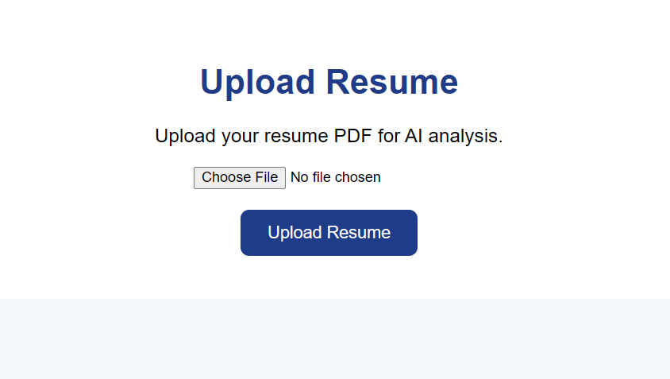

# AI Resume Screening System

## Overview

AI Resume Screening System is a web-based application that automates resume analysis and candidate evaluation.

The system extracts information from uploaded resumes, identifies technical skills, compares them with job requirements, and generates a matching score to help recruiters shortlist candidates efficiently.

---

## Features

- Resume PDF upload
- Automatic resume text extraction
- Resume text preprocessing
- Technical skill identification
- Job requirement analysis
- Resume and job matching score
- Missing skill identification
- User-friendly web interface

---

## Technologies Used

### Backend
- Python
- Flask

### Frontend
- HTML
- CSS

### Libraries
- pypdf

### Development Tools
- VS Code
- Git
- GitHub

---
## AI Architecture

The system uses a hybrid approach combining traditional skill matching and NLP-based semantic similarity.

### Workflow

Resume PDF
↓
Text Extraction using pypdf
↓
Text Cleaning
↓
Skill Extraction
↓
Keyword Matching
↓
Sentence Transformer NLP Model
↓
Cosine Similarity Calculation
↓
Resume Match Score
↓
Skill Recommendation

### NLP Model Used

- Sentence Transformer: all-MiniLM-L6-v2
- Semantic embeddings for understanding resume and job description meaning
- Cosine similarity for similarity calculation

## Screenshots

### Resume Upload Page

### Resume Analysis Result

## Project Highlights

- Automated resume screening using Artificial Intelligence
- NLP-based semantic resume and job description matching
- Skill gap identification
- Personalized skill improvement recommendation
- Web-based recruiter-friendly interface
- Modular Python architecture

## System Workflow
